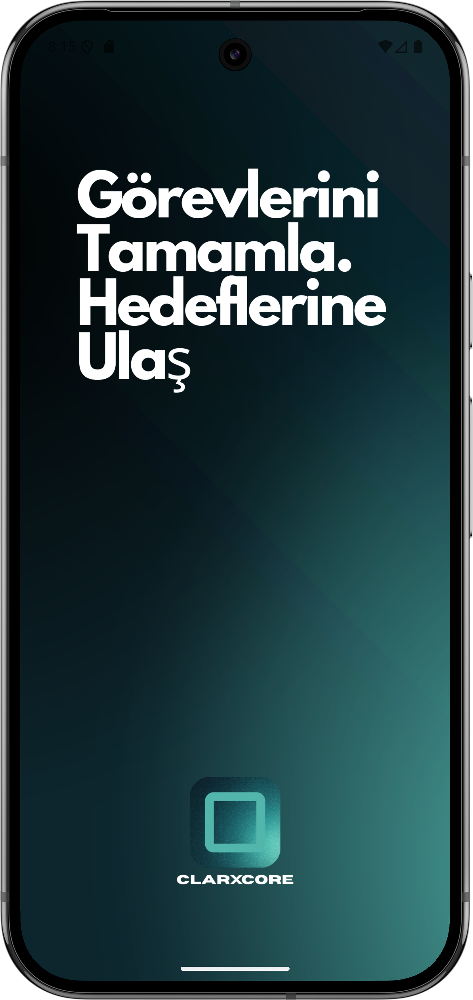
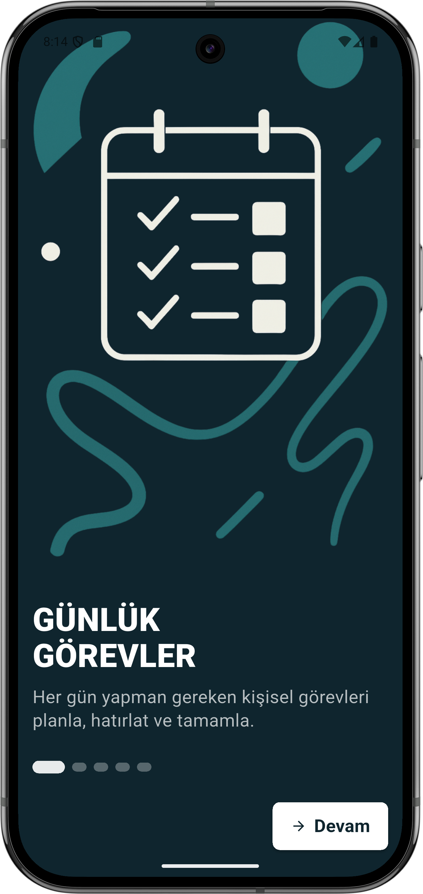
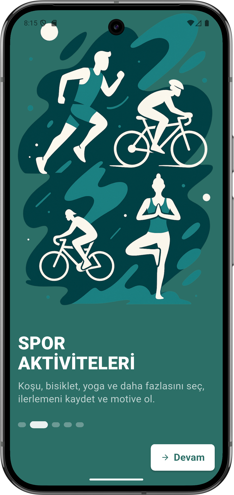
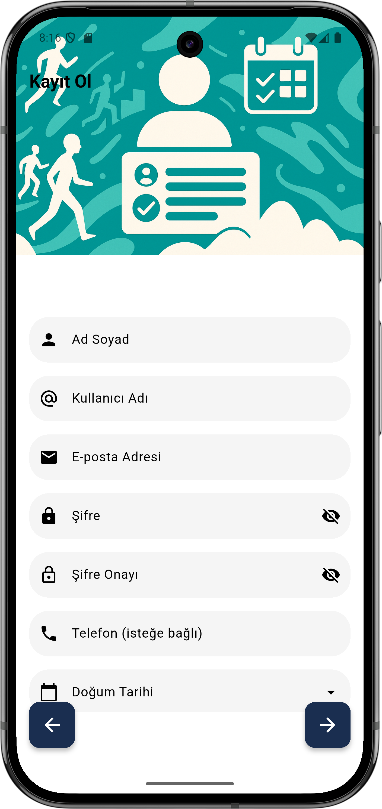
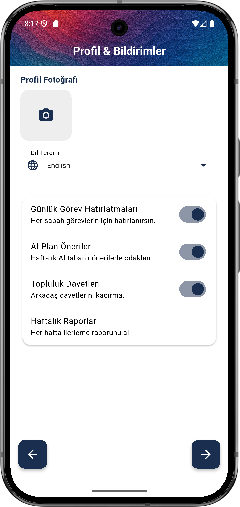
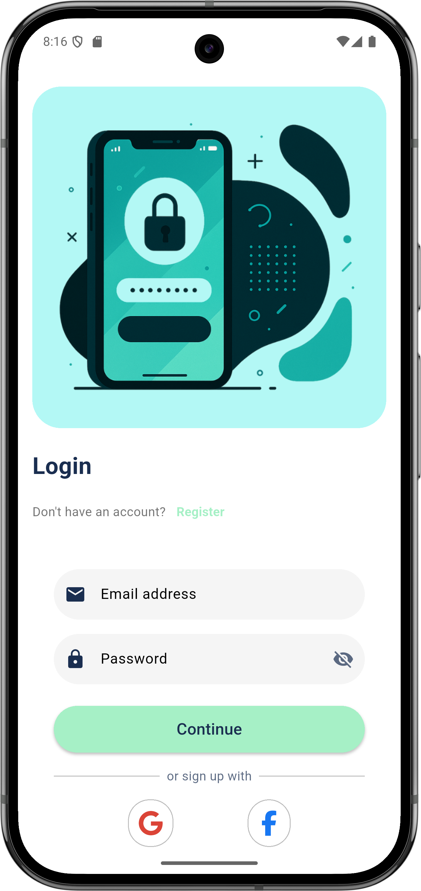
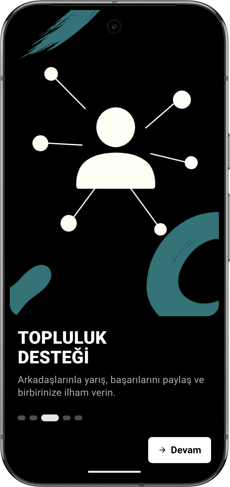
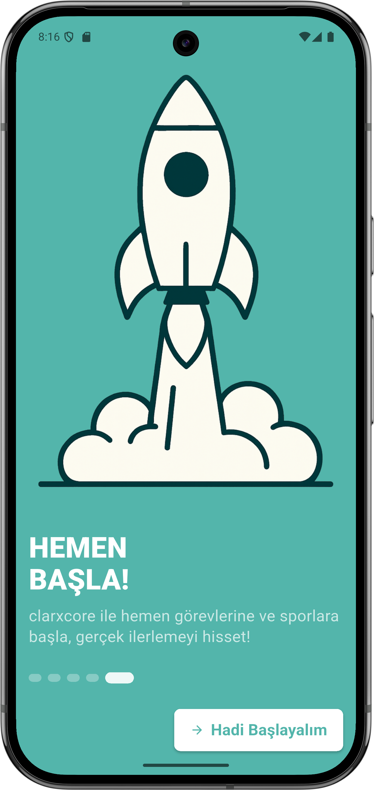

# ClarxCore App

[](https://flutter.dev/) [](LICENSE) [](https://github.com/clarxcompany/clarxcore_app/actions)

---

## 📖 Table of Contents

- [🚀 Overview](#🚀-overview)  
- [🔑 Key Features](#🔑-key-features)  
- [📸 Screenshots](#📸-screenshots)  
- [🛠️ Getting Started](#🛠️-getting-started)  
  - [Prerequisites](#prerequisites)  
  - [Installation & Running](#installation--running)  
- [📂 Project Structure](#📂-project-structure)  
- [⚙️ Configuration](#⚙️-configuration)  
- [🌿 Branching & Versioning](#🌿-branching--versioning)  
- [🤝 Contributing](#🤝-contributing)  
- [📜 License](#📜-license)  
- [📬 Contact](#📬-contact)  
- [💾 Next Steps](#💾-next-steps)  

---

## 🚀 Overview

**ClarxCore** is a cross-platform Flutter application for managing real-world missions and tracking personal progress. Built with Firebase for authentication and real-time data, it offers:

- Intuitive multi-step registration  
- Custom splash & onboarding flows  
- Daily task reminders & AI-powered suggestions  
- Community invites & weekly progress reports  

It’s designed for scalability and modularity—serving as the foundation for future ClarxCompany projects like **clarxAI**, **clarxcoin**, and more.

---

## 🔑 Key Features

### Branded Splash & Routing  
3 s animated splash, then auto-redirect based on login status.  


### Secure Authentication  
Email/password + Google/Facebook SSO with choice screens.  
  


### Streamlined Registration  
Validated multi-form flow with progress indicators.  
  


### Real-Time Dashboard  
Live overview of active missions & history.  


### Theming & Accessibility  
Light/dark modes, responsive layout, custom color palette in `main.dart`.

---

## 📸 Screenshots

<div align="center">
    
    
    
</div>


---

## 🛠️ Getting Started

### Prerequisites

- [Flutter SDK ≥ 3.7.0](https://flutter.dev/docs/get-started/install)  
- Android Studio or Xcode (for emulators & tooling)  
- Firebase project with **Authentication** & **Firestore** enabled  

### Installation & Running

```bash
# 1. Clone the repo
git clone https://github.com/clarxcompany/clarxcore_app.git
cd clarxcore_app

# 2. Install dependencies
flutter pub get

# 3. Run on Android/iOS/Web
flutter run            # default device
flutter run -d chrome  # web
```

---

## 📂 Project Structure

```
clarxcore_app/
├─ android/               # Android native project
├─ ios/                   # iOS native project
├─ lib/
│  ├─ main.dart           # Entry point & theme
│  ├─ firebase_options.dart
│  ├─ screens/            # UI screens & flows
│  │   ├─ splash_screen.dart
│  │   ├─ auth_choice_screen.dart
│  │   ├─ register_flow.dart
│  │   ├─ login_page.dart
│  │   ├─ home_screen.dart
│  │   └─ legal/           # Terms & Privacy
│  ├─ services/           # Firestore & business logic
│  └─ widgets/            # Reusable components
├─ assets/
│  ├─ icons/
│  ├─ images/
│  └─ legal/              # Markdown docs
├─ docs/
│  └─ screenshots/
├─ test/                  # Unit & widget tests
└─ pubspec.yaml           # Dependencies & assets
```

---

## ⚙️ Configuration

- **Theme Colors**: Defined in `lib/main.dart`  
- **Language & Timezone**: Config in `lib/screens/step2_profile_contact.dart`  
- **Notification Settings**: Stored per-user in Firestore  
- **Device Integrations**: Under `step5_device_integrations.dart`  

---

## 🌿 Branching & Versioning

- **main**: Always deployable, protected  
- **feature/**: New features (e.g. `feature/login-ui`)  
- **hotfix/**: Critical fixes on `main`  
- **release/**: Release candidates  

Versioning follows [SemVer](https://semver.org/):

```yaml
version: 1.1.0+1  # <major>.<minor>.<patch>+<build>
git tag -a v1.1.0 -m "Release 1.1.0 – added new UI components"
git push origin v1.1.0
```

---

## 🤝 Contributing

We welcome your help! Please:

1. Fork the repo  
2. Create a branch: `git checkout -b feature/your-feature`  
3. Commit changes: `git commit -m "feat: add awesome feature"`  
4. Push: `git push origin feature/your-feature`  
5. Open a PR against `main`  

See `CONTRIBUTING.md` for details.

---

## 📜 License

This project is licensed under the **MIT License**. See [LICENSE](LICENSE) for details.

---

## 📬 Contact

- **GitHub**: [clarxcompany/clarxcore_app](https://github.com/clarxcompany/clarxcore_app)  
- **Email** : clarxcompany@gmail.com  

---

## 💾 Next Steps

1. Save this file (`README.md`)  
2. `git add README.md`  
3. `git commit -m "chore: modernize README"`  
4. `git push`  
